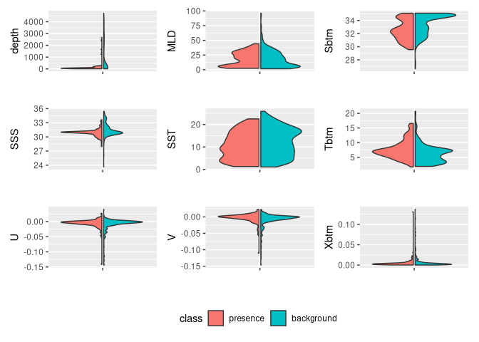

My Second Species
================

First we run our setup function.

``` r
source("/home/tvnguy28/ColbyForecasting/setup.R")
```

Our second species, Ditylum brightwelli, is an autotrophic unicellular
phytoplankton and is preyed on by our first species, the copepod Temora
longicornis. To help us keep track of changes to the model input, let’s
make a configuration file for our second species.

``` r
SPECIES2 = "Ditylum brightwellii"
```

Let’s load the prequisites required for our model. `coast` represents
the coastline of the gulf of maine, which is helpful for visualization.
`present` is the Brickman prediction for current temperature and
scenarios. From the Brickman dataset, we also pull `mask` which defines
the region of the Gulf of Maine for which we have a prediction. This is
helpful for filtering out entries and records whose spatial and temporal
coords are outside of Brickman’s scope.

``` r
coast = read_coastline()
present = brickman_database() |>
  dplyr::filter(scenario == "PRESENT", interval == "mon") |> read_brickman()
mask = brickman_database() |>
  filter(scenario == "STATIC", var == "mask") |> read_brickman()
```

We made a custom function to read directly from our second species.
Let’s read our OBIS entries from here.

``` r
obs = read_Dbrightwelli()
```

    ## Retrieved 1043 records of approximately 1043 (100%)

Perform thinning on our data.

``` r
thinned_obs = sapply(month.abb,
               function(mon){ 
                 temp_x = obs |> filter(month == mon)
                 if(nrow(temp_x) == 0) return(NULL)
                 thin_by_cell(temp_x, mask)
               }, simplify = FALSE) |>
  dplyr::bind_rows() 
```

Quickly tally up our observations. Later on, we use this to determine
the average count of observations, which we use for our background
sampling rate.

``` r
LON0 = -67
LAT0 = 46
all_counts = count(st_drop_geometry(obs), month) # counting is faster without spatial baggage
all_counts
```

    ## # A tibble: 12 × 2
    ##    month     n
    ##    <fct> <int>
    ##  1 Jan      15
    ##  2 Feb      14
    ##  3 Mar      24
    ##  4 Apr      10
    ##  5 May       6
    ##  6 Jun      14
    ##  7 Jul       9
    ##  8 Aug      31
    ##  9 Sep      72
    ## 10 Oct      73
    ## 11 Nov      62
    ## 12 Dec      38

Calculate the background points per month.

``` r
nback_avg = mean(all_counts$n) |>
  round()
nback_avg
```

    ## [1] 31

For each month, generate random background points.

``` r
obsbkg <- sapply(month.abb,
  function(mon) {
    sample_background(
      thinned_obs |> filter(month == mon),
      mask,
      method = "random",  # <-- it needs to know it's a bias map
      return_pres = TRUE, # <-- give me the obs back, too
      n = nback_avg) |>   # <-- how many points
      mutate(month = mon, .before = 1)
  }, simplify = FALSE) |>
  bind_rows() |>
  mutate(month = factor(month, levels = month.abb))
obsbkg
```

    ## Simple feature collection with 567 features and 2 fields
    ## Geometry type: POINT
    ## Dimension:     XY
    ## Bounding box:  xmin: -74.39811 ymin: 38.8797 xmax: -65.02004 ymax: 45.37854
    ## Geodetic CRS:  WGS 84
    ## # A tibble: 567 × 3
    ##    month class                geometry
    ##  * <fct> <fct>             <POINT [°]>
    ##  1 Jan   presence    (-73.2629 40.107)
    ##  2 Jan   presence   (-69.1691 42.7539)
    ##  3 Jan   presence   (-70.6925 42.4245)
    ##  4 Jan   presence (-67.01617 44.96267)
    ##  5 Jan   presence     (-69.709 40.564)
    ##  6 Jan   presence      (-73.1166 39.9)
    ##  7 Jan   presence   (-73.6903 40.3362)
    ##  8 Jan   presence     (-67.167 41.696)
    ##  9 Jan   presence (-66.93083 44.92083)
    ## 10 Jan   presence     (-67.784 41.218)
    ## # ℹ 557 more rows

## Covariates

We now move on to prepare our covariates, first we read from the present
Brickman data and choose to filter out collinear data.

``` r
keep = filter_collinear(present, method = "cor_caret", cutoff = 0.65)
keep
```

    ## [1] "SSS"  "U"    "Sbtm" "V"    "Tbtm" "MLD"  "SST" 
    ## attr(,"to_remove")
    ## [1] "Xbtm"

Add depth and month to list of covariates.

``` r
keep = c("depth", "month", keep)
```

Earlier we saved our model input, with background points in obsbkg.
Let’s make a copy and call it model_input

``` r
model_input = obsbkg
```

Add depth to list of extract Brickman variables

``` r
present = read_brickman(add = c("depth"))
```

We extract the environmental covariates.

``` r
variables = extract_brickman(present, model_input, form = "wide")
variables
```

    ## Simple feature collection with 567 features and 12 fields
    ## Geometry type: POINT
    ## Dimension:     XY
    ## Bounding box:  xmin: -74.39811 ymin: 38.8797 xmax: -65.02004 ymax: 45.37854
    ## Geodetic CRS:  WGS 84
    ## # A tibble: 567 × 13
    ##    .id   month class    depth   MLD  Sbtm   SSS   SST  Tbtm         U        V
    ##    <chr> <fct> <fct>    <dbl> <dbl> <dbl> <dbl> <dbl> <dbl>     <dbl>    <dbl>
    ##  1 p001  Jan   presence  44.2 38.8   32.1  31.9  6.83  7.40 -0.00867   0.00369
    ##  2 p002  Jan   presence 156.  40.2   34.3  31.1  3.74  7.29 -0.00757  -0.00610
    ##  3 p003  Jan   presence  51.4 27.1   31.6  31.0  3.81  4.75 -0.00865  -0.00179
    ##  4 p004  Jan   presence  14.8  6.93  30.7  30.4  2.73  3.50  0.00314   0.0226 
    ##  5 p005  Jan   presence  64.6 42.6   31.7  31.2  5.50  6.07 -0.0352   -0.00726
    ##  6 p006  Jan   presence  59.4 41.8   32.8  31.9  7.23  8.90 -0.0174    0.00189
    ##  7 p007  Jan   presence  26.4 25.1   31.7  31.7  5.56  5.61  0.0130    0.00702
    ##  8 p008  Jan   presence  54.1 34.9   32.1  31.0  4.91  6.24 -0.000636 -0.00853
    ##  9 p009  Jan   presence  27.3  8.70  30.9  30.7  3.64  4.21 -0.00865   0.0130 
    ## 10 p010  Jan   presence  43.1 37.7   31.2  31.1  5.61  5.73 -0.0148   -0.0181 
    ## # ℹ 557 more rows
    ## # ℹ 2 more variables: Xbtm <dbl>, geometry <POINT [°]>

We don’t need the .id column.

``` r
variables = variables |>
  mutate(class = model_input$class) |>    # the $ extracts a column 
  select(-.id)                            # the minus means "deselect" or "drop"
variables
```

    ## Simple feature collection with 567 features and 11 fields
    ## Geometry type: POINT
    ## Dimension:     XY
    ## Bounding box:  xmin: -74.39811 ymin: 38.8797 xmax: -65.02004 ymax: 45.37854
    ## Geodetic CRS:  WGS 84
    ## # A tibble: 567 × 12
    ##    month class    depth   MLD  Sbtm   SSS   SST  Tbtm         U        V    Xbtm
    ##    <fct> <fct>    <dbl> <dbl> <dbl> <dbl> <dbl> <dbl>     <dbl>    <dbl>   <dbl>
    ##  1 Jan   presence  44.2 38.8   32.1  31.9  6.83  7.40 -0.00867   0.00369 0.00336
    ##  2 Jan   presence 156.  40.2   34.3  31.1  3.74  7.29 -0.00757  -0.00610 0.00346
    ##  3 Jan   presence  51.4 27.1   31.6  31.0  3.81  4.75 -0.00865  -0.00179 0.00314
    ##  4 Jan   presence  14.8  6.93  30.7  30.4  2.73  3.50  0.00314   0.0226  0.00829
    ##  5 Jan   presence  64.6 42.6   31.7  31.2  5.50  6.07 -0.0352   -0.00726 0.0136 
    ##  6 Jan   presence  59.4 41.8   32.8  31.9  7.23  8.90 -0.0174    0.00189 0.00630
    ##  7 Jan   presence  26.4 25.1   31.7  31.7  5.56  5.61  0.0130    0.00702 0.00529
    ##  8 Jan   presence  54.1 34.9   32.1  31.0  4.91  6.24 -0.000636 -0.00853 0.00304
    ##  9 Jan   presence  27.3  8.70  30.9  30.7  3.64  4.21 -0.00865   0.0130  0.00559
    ## 10 Jan   presence  43.1 37.7   31.2  31.1  5.61  5.73 -0.0148   -0.0181  0.00851
    ## # ℹ 557 more rows
    ## # ℹ 1 more variable: geometry <POINT [°]>

Let’s look at a comparison of the covariates distribution between our
presence and background points.

``` r
plot_pres_vs_bg(variables |> select(-month), "class")
```

<!-- -->

``` r
cfg = list(
  version = "v1",
  scientificname = SPECIES2,
  background = "average of observations per month",
  bias = "random",
  thinning = "true",
  keep_vars =  keep)


write_configuration(cfg)          
```

We wrote the configuration to disk, now it’s time to read it back.

``` r
rcfg = read_configuration(SPECIES2, "v1")
```

And finally, write everything we computed to the disk.

``` r
write_model_input(variables, scientificname = SPECIES2, version = "v1")
```

``` r
# model_input = read_model_input(scientificname = SPECIES2)
# example read model input
```
