---
## Introduction

_Temora longicornis_ is a marine calanoid copepod (1-2 mm) widely distributed across temperate and boreal waters of the North Atlantic Ocean, including the Gulf of Maine. This planktonic crustacean plays a crucial role in marine food webs as a primary consumer of phytoplankton and microzooplankton, while serving as essential prey for larval and juvenile fish, including commercially important Atlantic herring (_Clupea harengus_) and Atlantic cod (_Gadus morhua_) Casini et al., 2004). _T. longicornis_ is abundant and has been shown to make up a large majority of copepod biomass in western Gulf of Maine (Manning & Bucklin, 2005). The species has also been pointed responsible for nearly half of the daily primary production removal (Doall et al., 1998). 

The species exhibits several important biological characteristics influencing its distribution. As a lipid-poor copepod with limited energy storage, _T. longicornis_ is highly dependent on food availability and exhibits strong seasonal abundance patterns (Kane & Prezioso, 2008). The species performs diel vertical migration, moving between surface and deeper waters in response to light, which affects its exposure to different environmental conditions (Dam & Peterson, 1993, Manning & Bucklin, 2005). Unlike other copepod species, _T. longicornis_ has demonstrated notable resilience to environmental stressors, including elevated CO₂ and harmful algal blooms (Deschler et al., 2024; McConville et al., 2013). 

Understanding _T. longicornis_ distribution under current and future climate scenarios is important for ecosystem-based fisheries management and marine conservation. As climate change alters ocean conditions, shifts in copepod communities—including changes in the relative abundances of _T. longicornis_ and key species like _Calanus finmarchicus_—could fundamentally restructure marine ecosystems in the region (Pershing et al., 2021). This study uses species distribution models (SDMs) to predict current and future distribution of _T. longicornis_ in the Gulf of Maine, providing information for fisheries management, conservation planning, and understanding how this resilient species may respond to environmental change.

## Data Processing

### Biological occurrences and environmental variables

Biological occurrences of _T. longicornis_ were obtained from OBIS, and environmental covariates from the Brickman dataset (Brickman et al., 2021). From OBIS, more than 8000 records were pulled, then filtered to around 3000 records, with most loss from removing material sample records and records without dates. 
### Datasets of origin and data quality

After filtering, the remaining data came from 7 datasets. Upon data quality inspection, all datasets provided reliable, research-grade occurrences of _Temora longicornis_ for the model.

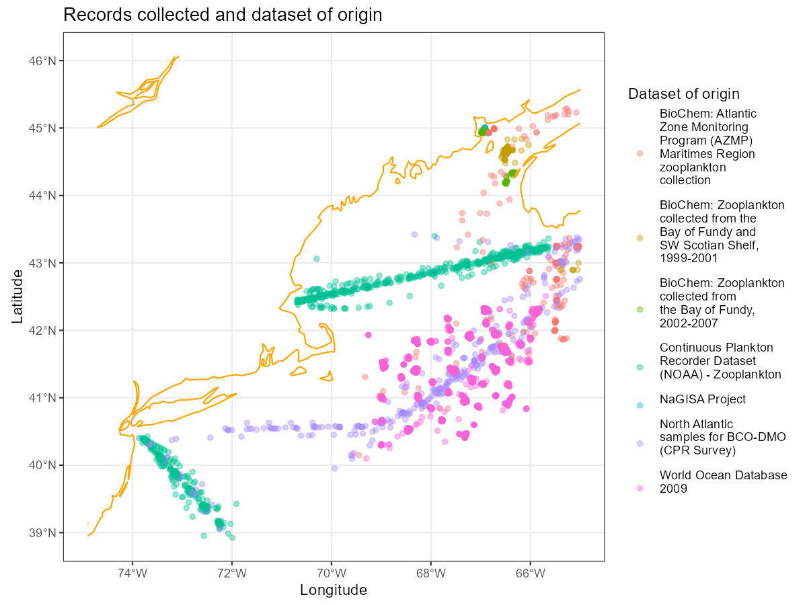

Of the 7 datasets, the 2 CPR surveys operated monthly (Fisheries, 2024; Helaouet et al., 2025), the World Ocean Database quarterly (World Ocean Database, 2020), and the other 4 conducted seasonal and opportunistic sampling in 2-5 year intervals . Sampling effort was most concentrated around summer, indicating temporal bias towards summer months (BioChem, n.d.). However, most points came from datasets with uniform sampling effort throughout the year, such as World Ocean Database 2009 and the CPR surveys (Figure 2). The dataset was abundant and covered every month, allowing us to treat time (in months) as an unbiased variable for easier interpretation of predictions.

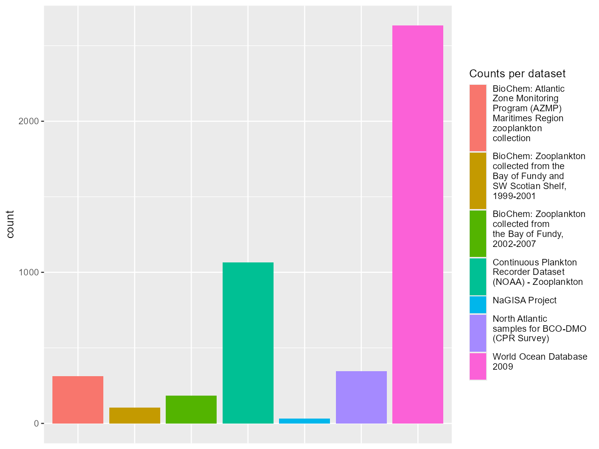

The data exhibited high spatial and environmental bias. CPR survey records were concentrated along merchant shipping routes where CPRs were towed. As a further example, records from NaGISA project were only sampled from 0 to 15m, representing environmental bias. (NAGISA, n.d.) We adjusted for these biases through background points (pseudo-absences) sampling, discussed below. We also used the Boyce Continuous Index, a spatially explicit metric previously used to quantify spatial bias in SDMs, to evaluate and fit the model.

## Modeling

We used this information to build models predicting _Temora longicornis_ distribution as nowcasts in 2025 and forecasts in both scenarios for 2055 and 2075.

### Process

1. **Data thinning**: Thinning involves setting an upper limit of presences per spatial unit to mitigate sampling bias and reduce computational work while maintaining performance (Aiello-Lammens, 2015). For this dataset, models trained on thinned data consistently performed worse than those without thinning. Therefore, final predictions were from models trained on unthinned data.
    
2. **Background points sampling**: Target-group background sampling is a bias-correction technique that samples background points with similar spatial bias to presence points, allowing models to detect ecologically significant correlations between environmental covariates and species distribution rather than mapping sampling effort (Phillips et al., 2009).
    
	From filtered records, we created a bias map using all observations and sampled background points accordingly. We chose the average number of observations in each month (n = ) as the number of background points per month. We experimented with multipliers (2n and 3n) as recommended, but found that models with multiplied background points (i) did not yield better metrics and (ii) skewed predictions towards background points.
    
	Models with target-group background points performed better than those using random background sampling. Additionally, models trained with random background relied more on covariates with significantly different distributions between presence and background points. Therefore, we presented predictions using models trained on target-group background sampling.
    
    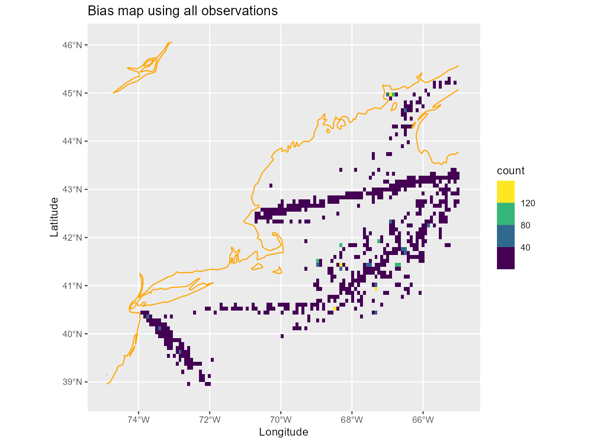
    
    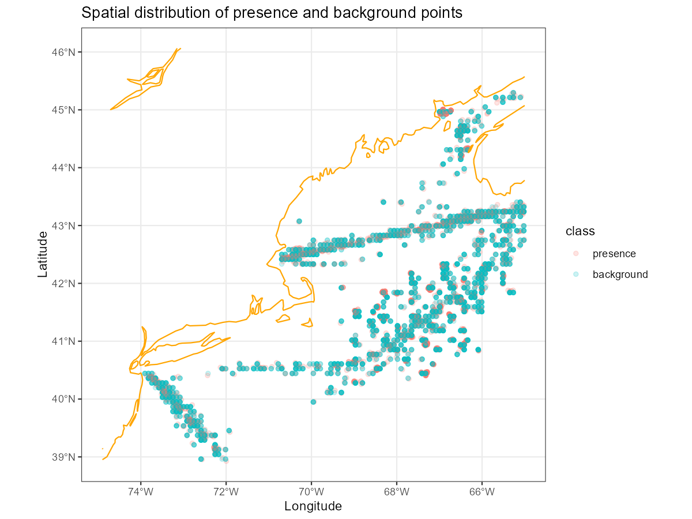
    
3. **Covariates filtering**: From the Brickman dataset, we extracted the following environmental covariates:
    - depth (converted to log10 form)
    - sea surface salinity (SSS)
    - salinity at bottom (Sbtm)
    - sea surface temperature (SST)
    - temperature at bottom (Tbtm)
    - horizontal current speed (U)
    - vertical current speed (V)
    - mixed layer depth (MLD)
    
	We also converted each record's month into an environmental covariate. Note the surge of record counts around summer for presences and the uniform distribution of background points in Figure 4, which compared covariate distributions between presences and backgrounds. Since we assumed month was an unbiased covariate, summer surges of presences suggested an ecologically relevant relationship rather than sampling bias. Therefore, we did not apply target-group background sampling across the temporal dimension, choosing uniform background sampling for each month.
    
    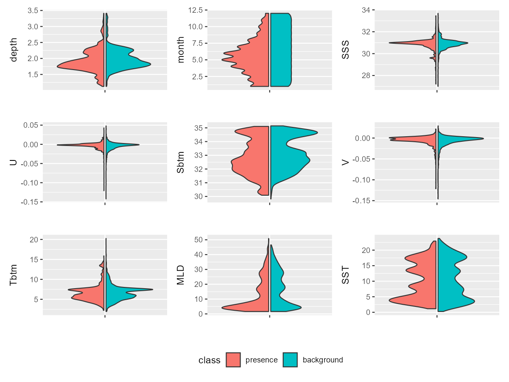
    
4. **Defining metrics**: To evaluate and train our SDMs, we used three common metrics:
    
    - **Boyce Continuous Index (CBI):** a threshold-independent, spatially explicit metric using only presence data to assess whether areas with higher predicted suitability contained greater frequency of actual occurrences compared to random distribution. It calculated Spearman rank correlation between predicted-to-expected (P/E) ratios and habitat suitability classes, ranging from -1 to 1 (>0.6 generally good, ≤0 indicates random performance).
    - **Area Under the Receiver Operating Characteristic Curve (ROC_AUC):** measured a model's ability to distinguish between presence and absence across all thresholds, ranging from 0.5 (random) to 1.0 (perfect), with >0.7 considered acceptable and >0.9 excellent.
    - **True Skill Statistic (TSS):** evaluated performance by accounting for both sensitivity and specificity, calculated as (sensitivity + specificity - 1), ranging from -1 to 1, with >0.4 useful, >0.6 good, and near 0 indicating random performance.
5. **Building and evaluating models**: We built four models: **Generalized Linear Model** (GLM), **Random Forest** (RF), **Boosted Trees** (Btree), and **Maximum Entropy** (MaxEnt). GLMs assume linear relationships, Random Forests handle complex non-linear patterns through ensemble learning, Boosted Trees sequentially improve predictions, and MaxEnt is designed for presence-only data. We evaluated each model using the three metrics defined above, training on 80% of data and testing on 20%. Code is available at this [Github repository](https://github.com/BigelowLab/tnn-sdm/).
    

### Model Performance

All models performed adequately by common SDM standards, with ROC_AUC scores of 0.6-0.7, CBI values of 0.6-0.8, and TSS scores of 0.3-0.4. While these metrics suggested reasonable discriminatory ability, they were lower than the 0.8+ ROC_AUC typically achieved in ecological SDM studies. (Klaassen et al., 2025)

MaxEnt consistently achieved the highest performance across all metrics (ROC_AUC: 0.734, CBI: 0.935, TSS: 0.38). GLM and Boosted Trees showed similar intermediate performance (ROC_AUC: ~0.71-0.72), while RF had the weakest performance (ROC_AUC: 0.69, CBI: 0.613, TSS: 0.345).

| Model  | accuracy | CBI   | ROC_AUC | TSS   |
| ------ | -------- | ----- | ------- | ----- |
| GLM    | 0.647    | 0.912 | 0.722   | 0.357 |
| RF     | 0.588    | 0.613 | 0.690   | 0.345 |
| Btree  | 0.672    | 0.431 | 0.714   | 0.374 |
| MaxEnt | 0.652    | 0.935 | 0.734   | 0.380 |

The moderate performance suggested several limitations: (1) missing important biological variables like food availability (phytoplankton, zooplankton, detritus) known to strongly influence _T. longicornis_ distribution, (2) spatial and temporal biases in occurrence data not fully corrected by background sampling, and (3) the complex three-dimensional nature of copepod distribution difficult to capture with two-dimensional environmental layers. Despite these limitations, the models provided useful insights into environmental factors associated with _T. longicornis_ distribution and allowed meaningful comparisons between current and future climate scenarios.

### **Predictions**

#### Overall Predictions and Partial Dependence Curves

##### Overall Generalized Linear Model Predictions

GLM predictions were almost opposite to other models: where other models predicted high HSI, GLM predicted low, and vice versa. This was evident from the Partial Dependence Curves (PDP), where curve directions were always opposite to other models, clearest when comparing GLM and MaxEnt. Overall, GLM predicted high HSI of _T. longicornis_ year-round, peaking in winter and around the continental shelf edge.

##### Overall Random Forest Predictions

RF produced the lowest HSI predictions among models but showed interesting patterns. It accurately predicted the inshore-offshore seasonal movement of _T. longicornis_ (Kane & Prezioso, 2008) and identified summer as the peak season.

##### Overall Boosted Tree Predictions

Btree predicted the most complicated pattern, with intricate marbling of high and low HSI regions in the GOM. It predicted consistent high HSI throughout the Gulf in spring and summer, with the species retreating from the continental shelf edge in winter. Like other models, it identified Georges Bank as a hotspot during autumn, especially in the RCP4.5 scenario.

##### Overall Maximum Entropy Predictions

MaxEnt's results were opposite to GLM's, predicting seasonal peak in spring, gradually decreasing throughout the year. The species appeared to move inshore as HSI decreased faster off the continental shelf.

#### Environmental contributions

All models identified month as an important variable. MaxEnt and GLM both highlighted month, MLD, SST, and Tbtm as most important. Btree was the outlier, attributing importance to depth and V (vertical current speed). RF had the most uniform importance distribution, attributing importance to variables other models ignored, such as SSS and Sbtm.

Given _T. longicornis'_ high food dependency, month as an important variable made biological sense. However, month was also the only variable with highly contrasted distribution between presence and background points (Figure 4), suggesting models might be memorizing patterns from biased data.

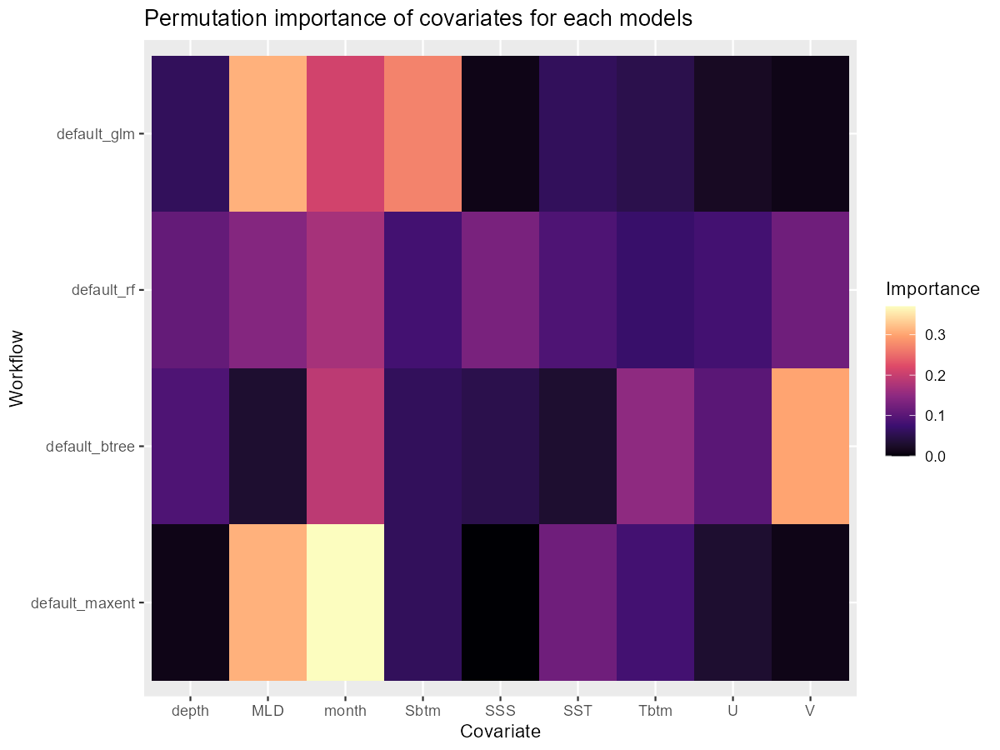

Certain patterns appeared across all models. A noticeable eye-shaped light spot (high predicted suitability) around Georges Bank appeared in all models at varying degrees. Upon inspection, the same pattern appeared in some covariate plots: Bottom temperature, Mixed Layer Depth, and Current Speed (calculated from U and V).

The bottom temperature showed the same eye-shaped pattern at Georges Bank.

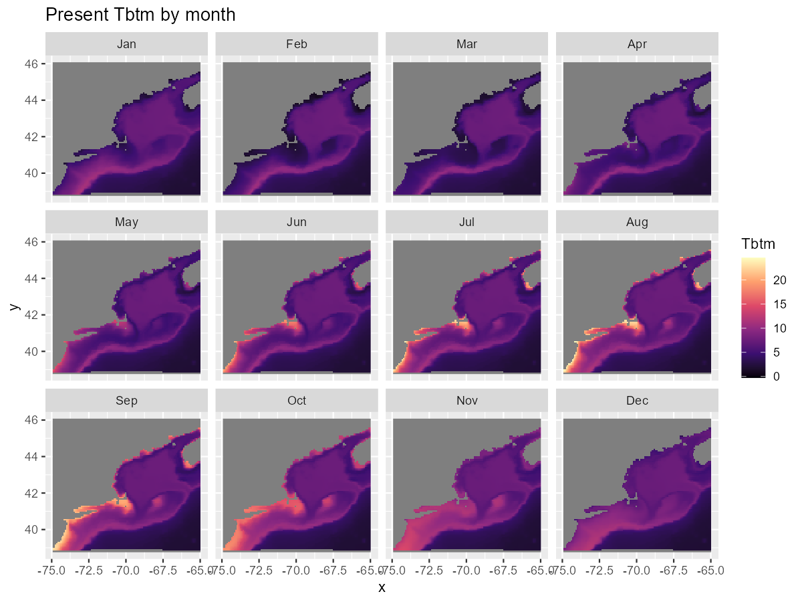

The same pattern appeared in MLD, though more subtle and around winter instead of summer.

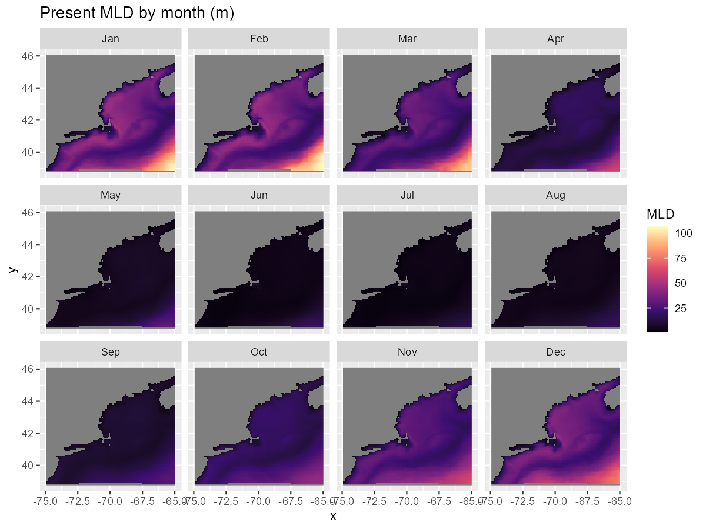

Current speed in GOM changed subtly throughout the year; January was chosen as representative. A high-speed current stream along the continental shelf edge appeared in all models. GLM predicted high HSI along the stream, while MaxEnt predicted the opposite. RF had a faint streak of low HSI along the stream, while Btree relied more on whether a point belonged inside or outside the continental shelf. Current speed was not the only contributor to prediction changes, as many covariates showed highly contrasted changes along the shelf edge. The continental shelf was a significant environmental feature in the GOM, governing many variables.

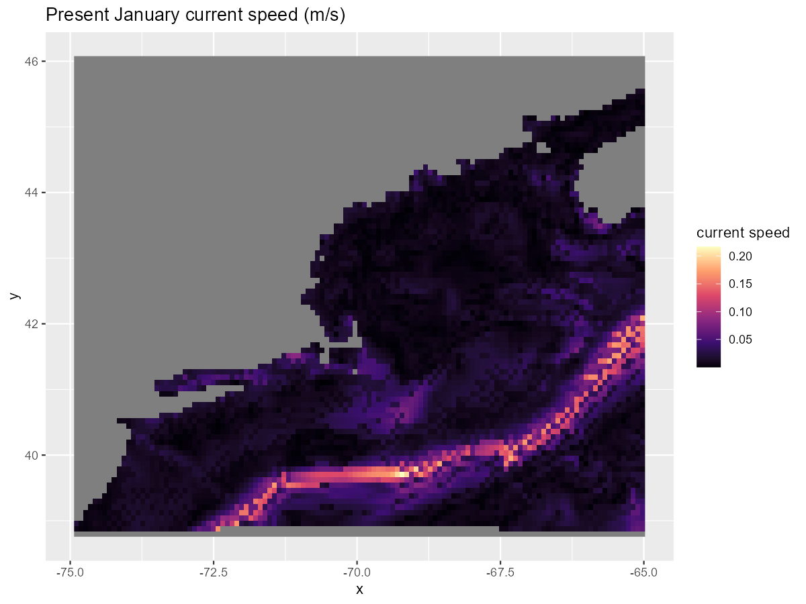

#### Comparison between Nowcasts and RCP8.5 2075 Forecast

To assess changes in habitat suitability, we compared predictions between nowcasts and forecasts from the most extreme scenario, RCP8.5 2075. Overall, there were minimal changes to _T. longicornis_ distribution. RF predicted the species moved inshore during spring and offshore during winter (Kane & Prezioso, 2008). Boosted Tree predicted a slight uniform, year-round increase in HSI. Models unanimously agreed that climate change had little impact on _T. longicornis_ and that the species would persist. This conclusion was unsurprising given the copepod's known resilience. Researchers had examined impacts of elevated CO₂ (McConville et al., 2013) and phytoplankton bloom intoxication (Deschler et al., 2024) on _T. longicornis_ survival, all finding little correlation.

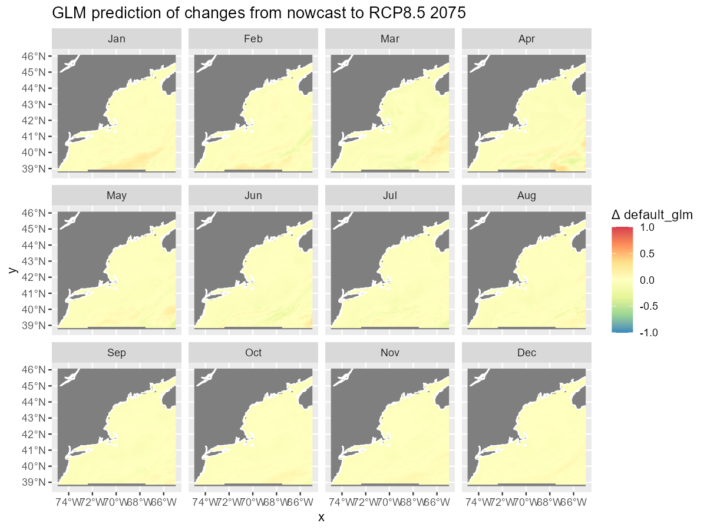

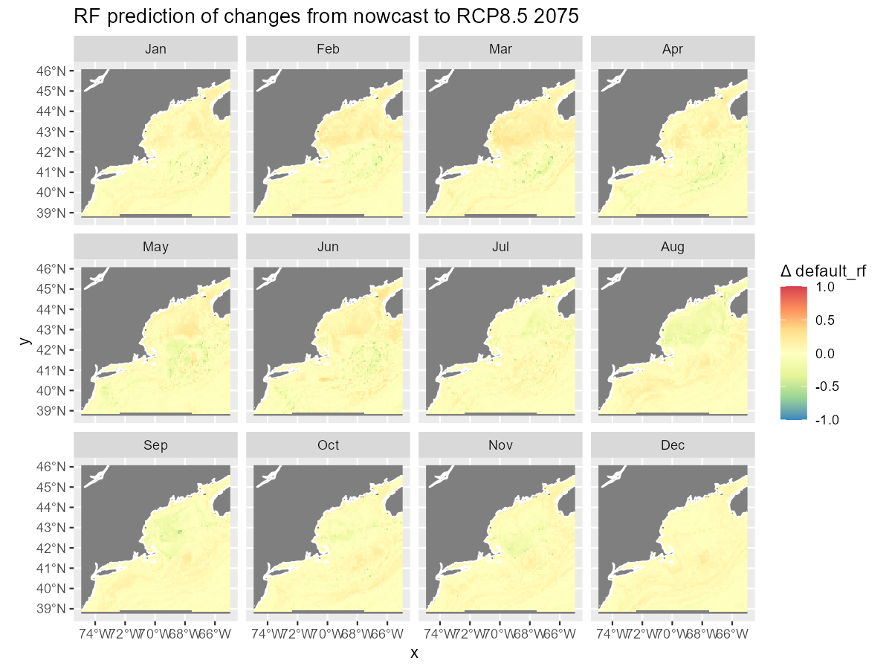

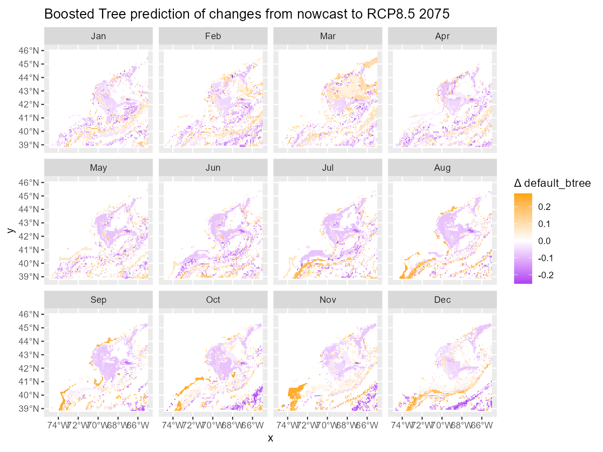

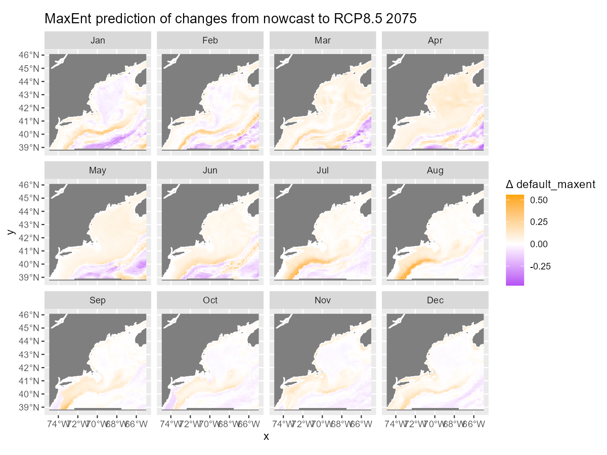

## Implications

This result was not an excuse to ignore climate change effects and ecosystem destruction.

First, the predictions were not entirely reliable. This study's best performing models had ROC_AUC scores of 0.6-0.7, while many ecological SDMs reach 0.8 and above. Biologically, the models were missing important variables that greatly contribute to modeling _T. longicornis_. A numerical simulation study highlighted food as a function of zooplankton, phytoplankton, and detritus (decaying seafloor matter) as the most important variable influencing species development (Grinienė et al., 2017). This aligned with previous studies on _T. longicornis'_ high food dependency, especially as a lipid-poor copepod with little energy storage (Franco-Santos et al., 2018). Moreover, as a species performing diel vertical migration, a more explicitly 3-dimensional ocean model could improve predictions. Such variables were missing in the Brickman dataset and therefore not accounted for. Future work should investigate and aggregate more pertinent environmental covariates.

Second, while _T. longicornis_ was resilient, most species were not. The effect of changing food webs due to climate change remained uncertain (Beaugrand et al., 2002). _T. longicornis_ is vital in diets of species like Atlantic herring (_Clupea harengus_), but it could not replace other species' roles such as _Calanus finmarchicus_ as whales in the Gulf of Maine lost their biggest food source (Ross et al., 2021). As domoic acid phytoplankton blooms occurred more frequently  (Deschler et al., 2024), _T. longicornis'_ survival against this toxin could transfer the toxin up the food chain to humans, endangering human health and the shellfish industry.

## Conclusion

This study applied four species distribution modeling approaches (GLM, Random Forest, Boosted Trees, and MaxEnt) to predict current and future distribution of _Temora longicornis_ in the Gulf of Maine under different climate scenarios. While all models achieved moderate performance (ROC_AUC: 0.60-0.70), MaxEnt was the most reliable. Models identified month, mixed layer depth, and temperature variables as key environmental correlates, though the absence of food availability data—critical for this lipid-poor copepod—limited performance. Projections to 2075 under RCP8.5 suggested minimal distribution changes, consistent with the species' known resilience. However, findings should be interpreted cautiously given model limitations and complex ecological implications of potential copepod community shifts. Future modeling would benefit from incorporating three-dimensional oceanographic data and food web variables to better capture the biology of this ecologically important planktonic species.

### Bibliography

Aiello-Lammens. (2015). _spThin: An R package for spatial thinning of species occurrence records for use in ecological niche models_. [https://doi.org/10.1111/ecog.01132](https://doi.org/10.1111/ecog.01132)

Beaugrand, G., Reid, P. C., Ibañez, F., Lindley, J. A., & Edwards, M. (2002). Reorganization of North Atlantic Marine Copepod Biodiversity and Climate. _Science_, _296_(5573), 1692–1694. [https://doi.org/10.1126/science.1071329](https://doi.org/10.1126/science.1071329)

_BioChem: Zooplankton collected from the Bay of Fundy and SW Scotian Shelf, 1999-2001_. (n.d.). Retrieved February 1, 2026, from [https://ipt.obis.org/nonode/resource?r=baumgartnerzooplankton](https://ipt.obis.org/nonode/resource?r=baumgartnerzooplankton)

_Biodiversity and Ecosystem Function in the Gulf of Maine: Pattern and Role of Zooplankton and Pelagic Nekton | PLOS One_. (2011). [https://journals.plos.org/plosone/article?id=10.1371/journal.pone.0016491](https://journals.plos.org/plosone/article?id=10.1371/journal.pone.0016491)

Casini, M., Cardinale, M., & Arrhenius, F. (2004). Feeding preferences of herring (Clupea harengus) and sprat (Sprattus sprattus) in the southern Baltic Sea. _ICES Journal of Marine Science_, _61_(8), 1267–1277. [https://doi.org/10.1016/j.icesjms.2003.12.011](https://doi.org/10.1016/j.icesjms.2003.12.011)

Dam, H., & Peterson, W. (1993). Seasonal contrasts in the diel vertical distribution, feeding behavior, and grazing impact of the copepod Temora Longicornis in Long Island Sound. _Journal of Marine Research_, _51_(3). [https://elischolar.library.yale.edu/journal_of_marine_research/2073](https://elischolar.library.yale.edu/journal_of_marine_research/2073)

Deschler, M., Boulangé-Lecomte, C., Duflot, A., Sauvey, A., Arcanjo, C., Coulaud, R., Jolly, O., Niquil, N., & Fauchot, J. (2024). First evidence of the induction of domoic acid production in _Pseudo_-_nitzschia australis_ by the copepod _Temora longicornis_ from the French coast. _Harmful Algae_, _135_, 102628. [https://doi.org/10.1016/j.hal.2024.102628](https://doi.org/10.1016/j.hal.2024.102628)

Doall, M. H., Colin, S. P., Strickler, J. R., & Yen, J. (1998). Locating a mate in 3D: The case of Temora longicornis. _Philosophical Transactions of the Royal Society B: Biological Sciences_, _353_(1369), 681–689. [https://doi.org/10.1098/rstb.1998.0234](https://doi.org/10.1098/rstb.1998.0234)

Fisheries, N. (2024, June 17). _Long-Running Plankton Survey to Resume in the Gulf of Maine | NOAA Fisheries_ (New England/Mid-Atlantic). NOAA. [https://www.fisheries.noaa.gov/feature-story/long-running-plankton-survey-resume-gulf-maine](https://www.fisheries.noaa.gov/feature-story/long-running-plankton-survey-resume-gulf-maine)

Franco-Santos, R. M., Auel, H., Boersma, M., De Troch, M., Meunier, C. L., & Niehoff, B. (2018). Bioenergetics of the copepod Temora longicornis under different nutrient regimes. _Journal of Plankton Research_, _40_(4), 420–435. [https://doi.org/10.1093/plankt/fby016](https://doi.org/10.1093/plankt/fby016)

Grinienė, E., Dzierzbicka-Głowacka, L., Lemieszek, A., Nowicki, A., Piskozub, J., Kalarus, M., Musialik-Koszarowska, M., Mudrak-Cegiołka, S., & Żmijewska, M. I. (2017). Intra-annual distribution of Temora longicornis biomass in the Gulf of Gdańsk (the southern Baltic Sea) – numerical simulations; pp. 256–273. _Estonian Journal of Earth Sciences_, _66_(4), 256–273. [https://doi.org/10.3176/earth.2017.21](https://doi.org/10.3176/earth.2017.21)

Helaouet, P., Sheppard, L., & Johns, D. (2025). _Continuous Plankton Recorder phytoplankton and zooplankton occurrence and count data from The CPR Survey in the Western North Atlantic Ocean from 1958 to 2022_ (Version 6) [Dataset]. Biological and Chemical Oceanography Data Management Office (BCO-DMO). [https://doi.org/10.26008/1912/BCO-DMO.765141.6](https://doi.org/10.26008/1912/BCO-DMO.765141.6)

Kane, J., & Prezioso, J. (2008a). Distribution and multi-annual abundance trends of the copepod Temora longicornis in the US Northeast Shelf Ecosystem. _Journal of Plankton Research_, _30_(5), 619–632. [https://doi.org/10.1093/plankt/fbn026](https://doi.org/10.1093/plankt/fbn026)

Kane, J., & Prezioso, J. (2008b). Distribution and multi-annual abundance trends of the copepod Temora longicornis in the US Northeast Shelf Ecosystem. _Journal of Plankton Research_, _30_(5), 619–632. [https://doi.org/10.1093/plankt/fbn026](https://doi.org/10.1093/plankt/fbn026)

Klaassen, M., Marques, T. A., Alves, F., & Fernandez, M. (2025). Trends in marine species distribution models: A review of methodological advances and future challenges. _Ecography_, _n/a_(n/a), e07702. [https://doi.org/10.1002/ecog.07702](https://doi.org/10.1002/ecog.07702)

Manning, C. A., & Bucklin, A. (2005). Multivariate analysis of the copepod community of near-shore waters in the western Gulf of Maine. _Marine Ecology Progress Series_, _292_, 233–249. [https://doi.org/10.3354/meps292233](https://doi.org/10.3354/meps292233)

McConville, K., Halsband, C., Fileman, E. S., Somerfield, P. J., Findlay, H. S., & Spicer, J. I. (2013). Effects of elevated CO2 on the reproduction of two calanoid copepods. _Marine Pollution Bulletin_, _73_(2), 428–434. [https://doi.org/10.1016/j.marpolbul.2013.02.010](https://doi.org/10.1016/j.marpolbul.2013.02.010)

Møller, E. F. (2007). Production of dissolved organic carbon by sloppy feeding in the copepods Acartia tonsa, Centropages typicus, and Temora longicornis. _Limnology and Oceanography_, _52_(1), 79–84. [https://doi.org/10.4319/lo.2007.52.1.0079](https://doi.org/10.4319/lo.2007.52.1.0079)

_NAGISA_. (n.d.). Retrieved February 1, 2026, from [https://www.iopan.gda.pl/projects/SIP/NAGISA/nagisa-methodology.html](https://www.iopan.gda.pl/projects/SIP/NAGISA/nagisa-methodology.html)

Pershing, A. J., Alexander, M. A., Brady, D. C., Brickman, D., Curchitser, E. N., Diamond, A. W., McClenachan, L., Mills, K. E., Nichols, O. C., Pendleton, D. E., Record, N. R., Scott, J. D., Staudinger, M. D., & Wang, Y. (2021). Climate impacts on the Gulf of Maine ecosystem: A review of observed and expected changes in 2050 from rising temperatures. _Elementa: Science of the Anthropocene_, _9_(1), 00076. [https://doi.org/10.1525/elementa.2020.00076](https://doi.org/10.1525/elementa.2020.00076)

Phillips, S. J., Dudík, M., Elith, J., Graham, C. H., Lehmann, A., Leathwick, J., & Ferrier, S. (2009). Sample selection bias and presence-only distribution models: Implications for background and pseudo-absence data. _Ecological Applications_, _19_(1), 181–197. [https://doi.org/10.1890/07-2153.1](https://doi.org/10.1890/07-2153.1)

Ross, C. H., Pendleton, D. E., Tupper, B., Brickman, D., Zani, M. A., Mayo, C. A., & Record, N. R. (2021). Projecting regions of North Atlantic right whale, Eubalaena glacialis, habitat suitability in the Gulf of Maine for the year 2050. _Elementa: Science of the Anthropocene_, _9_(1), 00058. [https://doi.org/10.1525/elementa.2020.20.00058](https://doi.org/10.1525/elementa.2020.20.00058)

_World Ocean Database_. (2020, November 10). National Centers for Environmental Information (NCEI). [https://www.ncei.noaa.gov/products/world-ocean-database](https://www.ncei.noaa.gov/products/world-ocean-database)